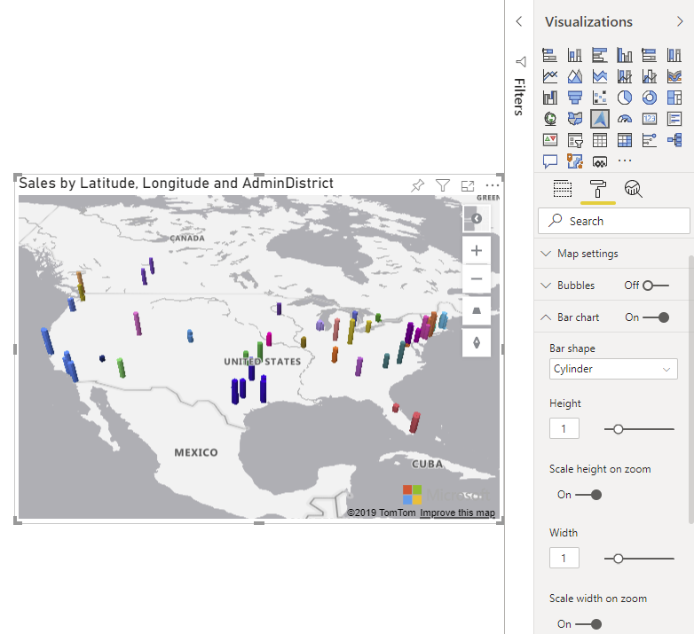

# Add a bar chart layer

The **Bar chart layer** is useful for taking data to the next dimension by allowing visualization of location data as 3D bars or cylinders on the map. Similar to the bubble layer, the bar chart later can easily visualize two metrics at the same time using color and relative height. In order for the bars to have height, a measure needs to be added to the **Size** bucket of the **Fields** pane. If a measure is not provided, bars with no height as flat squares or circles depending on the **Bar shape** option.

> [!div class="mx-imgBorder"]
> 

Users can tilt and rotate the map to view your data from different perspectives. The map can be tilted or pitched using one of the following methods.

-   Turn on the **Navigation controls** option in the **Map settings** of the **Format** pane. This will add a button to tilt the map.
-   Press the right mouse button down and drag the mouse up or down.
-   Using a touch screen, touch the map with two fingers and drag them up or down together.
-   With the map focused, hold the **Shift** key, and press the **Up** or **Down arrow** keys.

The map can be rotated using one of the following methods.

-   Turn on the **Navigation controls** option in the **Map settings** of the **Format** pane. This will add a button to rotate the map.
-   Press the right mouse button down and drag the mouse left or right.
-   Using a touch screen, touch the map with two fingers and rotate.
-   With the map focused, hold the **Shift** key, and press the **Left** or **Right arrow** keys.

The following are all settings in the **Format** pane that are available in the **Bar chart layer** section.

| Setting              | Description      |
|----------------------|------------------|
| Bar shape            | The shape of the 3D bar.  &nbsp;&nbsp;&nbsp;&nbsp;• Box – Bars rendered as rectangular boxes. &nbsp;&nbsp;&nbsp;&nbsp;• Cylinder – Bars rendered as cylinders. |
| Height               | The height of each bar. If a field is passed into the **Size** bucket of the **Fields** pane, bars will be scaled relative to this height value. |
| Scale height on zoom | Specifies if the height of the bars should scale relative to the zoom level. |
| Width                | The width of each bar.  |
| Scale width on zoom  | Specifies if the width of the bars should scale relative to the zoom level.  |
| Fill color           | Color of each bar. This option is hidden when a field is passed into the **Legend** bucket of the **Fields** pane and a separate **Data colors** section will appear in the **Format** pane. |
| Transparency         | Transparency of each bar. |
| Min zoom             | Minimum zoom level tiles are available. |
| Max zoom             | Maximum zoom level tiles are available. |
| Layer position       | Specifies the position of the layer relative to other map layers. |

> [!NOTE]
> If the bars have a small width value and the **Scale width on zoom** option is disabled, they may disappear when zoomed out a lot as their rendered width would be less than a pixel in size. However, when the **Scale width on zoom** option is enabled, additional calculations are performed when the zoom level changes which can impact performance of large data sets.

## Next steps

Add more context to the map:

> [!div class="nextstepaction"]
> [Add a reference layer](power-bi-visual-add-reference-layer.md)

> [!div class="nextstepaction"]
> [Add a tile layer](power-bi-visual-add-tile-layer.md)

> [!div class="nextstepaction"]
> [Show real-time traffic](power-bi-visual-show-real-time-traffic.md)

Customize the visual:

> [!div class="nextstepaction"]
> [Tips and tricks for color formatting in Power BI](https://docs.microsoft.com/power-bi/visuals/service-tips-and-tricks-for-color-formatting)

> [!div class="nextstepaction"]
> [Customize visualization titles, backgrounds, and legends](https://docs.microsoft.com/power-bi/visuals/power-bi-visualization-customize-title-background-and-legend)